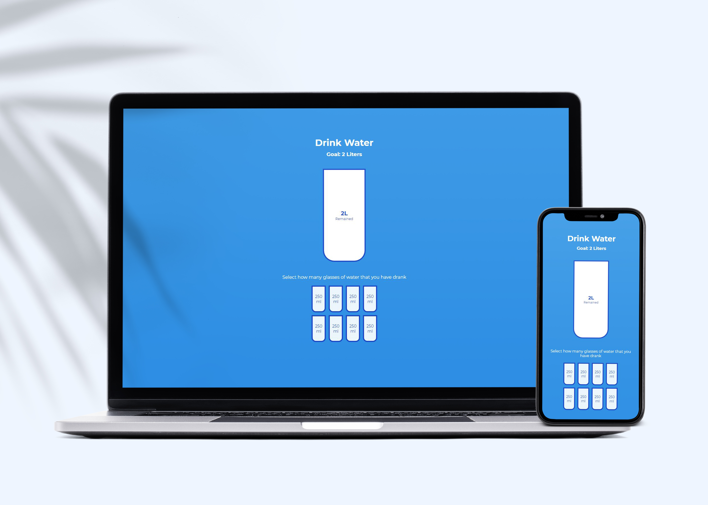

# Drink Water App



## 🦉 Main information

Cool app to track the amount of water you have drank built with Html, CSS and Vanilla JavaScript.

The project goal:

- track cups of water to win a goal of two liters
- when you click on one small cup, you see the % of water in a big cup as well as the amount of water left
- set up in HTML, style it with CSS and add the functionality with JavaScript

View Demo and have fun here <a href="https://js-drink-water.netlify.app/" target="_blank">Drink Water</a> 

## 🦊 Useful links 

### forEach() method

```
https://developer.mozilla.org/en-US/docs/Web/JavaScript/Reference/Global_Objects/Array/forEach
```

### Element.nextElementSibling

```
https://developer.mozilla.org/en-US/docs/Web/API/Element/nextElementSibling
```


## ⚡ Built With
[HTML5](https://www.w3schools.com/html/) / [CSS3](https://www.w3schools.com/css/) / [JavaScript](https://www.w3schools.com/js/)